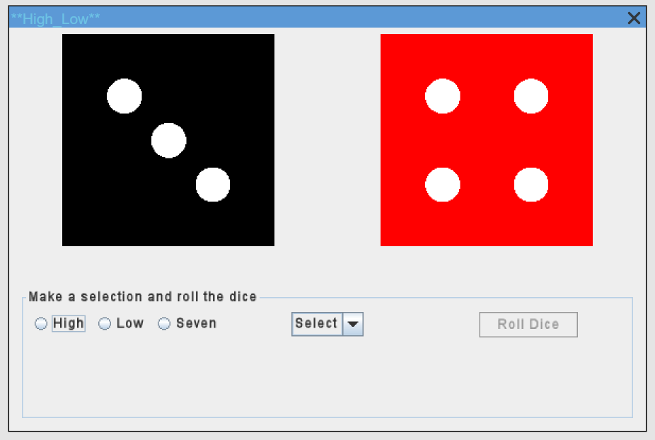

[![LinkedIn][linkedin-shield]][linkedin-url]

<!-- PROJECT LOGO -->
 

  <h3 align="center">Dice Game</h3>

  

   A simple dice game.  
     
  

<!-- TABLE OF CONTENTS -->

  
Table of Contents

  <ol>
    <li>
      <a href="#about-the-project">About The Project</a>
      <ul>
        <li><a href="#built-with">Built With</a></li>
      </ul>
    </li>
    <li><a href="#license">License</a></li>
  </ol>

<!-- ABOUT THE PROJECT -->
## About The Project

This is the dice game Hi-Lo. For more information on it and if you'd like to play it, visit [my website.](https://purplefootsteps.co.uk/dice-game/)

### Built With

Built with good old [Java](https://www.java.com/en/)

<!-- LICENSE -->
## License

Distributed under the MIT License. See `LICENSE` for more information.

<!-- CONTACT -->
## Contact

Linda Scoon - [@linda_scoon](https://twitter.com/linda_scoon) - Twitter

<!-- MARKDOWN LINKS & IMAGES --> 
[linkedin-shield]: https://img.shields.io/badge/-LinkedIn-black.svg?style=for-the-badge&logo=linkedin&colorB=555
[linkedin-url]: https://www.linkedin.com/in/linda-scoon/
